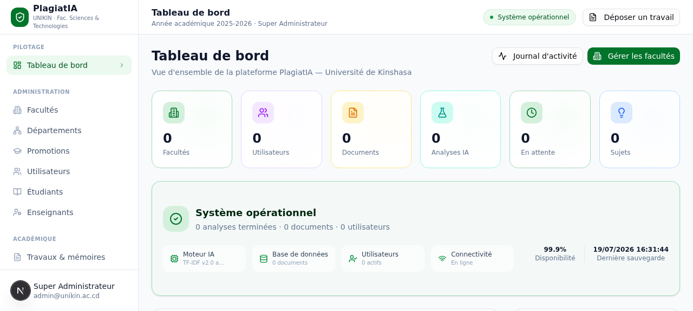
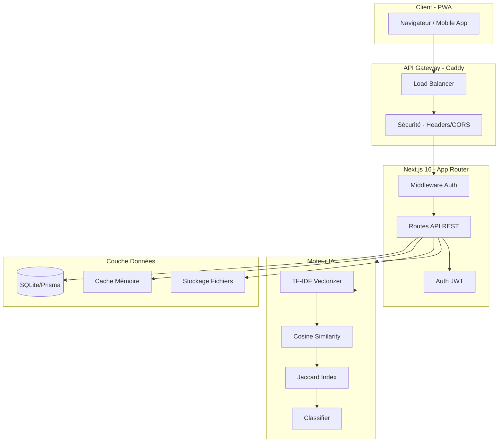

# 🎓 PlagiatIA — Plateforme Anti-Plagiat Académique

<p align="center">
  
</p>

<p align="center">
  <strong>Détection intelligente du plagiat académique par Intelligence Artificielle</strong><br>
  <em>Cas pilote : Faculté des Sciences — Université de Kinshasa (UNIKIN)</em>
</p>

<p align="center">
  <a href="#fonctionnalites">Fonctionnalités</a> •
  <a href="#architecture">Architecture</a> •
  <a href="#tech-stack">Tech Stack</a> •
  <a href="#installation">Installation</a> •
  <a href="#configuration">Configuration</a> •
  <a href="#api">API</a> •
  <a href="#contribuer">Contribuer</a>
</p>

---

## 📋 Table des matières

- [A propos](#apropos)
- [Fonctionnalités](#fonctionnalites)
- [Captures d'écran](#captures-decran)
- [Architecture](#architecture)
- [Tech Stack](#tech-stack)
- [Prérequis](#prerequis)
- [Installation](#installation)
- [Configuration](#configuration)
- [Utilisation](#utilisation)
- [Documentation API](#api)
- [Moteur IA](#moteur-ia)
- [Sécurité](#securite)
- [Performance](#performance)
- [Déploiement](#deploiement)
- [Roadmap](#roadmap)
- [Contribuer](#contribuer)
- [Licence](#licence)

---

## 🎯 A propos

**PlagiatIA** est une plateforme web complète de détection et de prévention du plagiat académique, conçue spécifiquement pour le contexte universitaire africain. Développée initialement comme cas pilote pour la **Faculté des Sciences de l'Université de Kinshasa**, elle utilise des algorithmes de traitement du langage naturel (NLP) et d'apprentissage automatique pour analyser les travaux académiques (mémoires, thèses, TFC) et détecter automatiquement les similarités suspectes.

### Problématique

Le plagiat académique représente un défi majeur pour les universités :
- **Volume croissant** de documents à vérifier manuellement
- **Accès limité** aux solutions commerciales (Turnitin, etc.) coûteuses
- **Besoin d'adaptation** au contexte linguistique francophone
- **Exigence de souveraineté** des données académiques

### Solution

PlagiatIA propose :
- ✅ Une solution **open-source** et économique
- Un moteur IA **multilingue** (Français/Anglais)
- Une architecture **déployable on-premise** (données souveraines)
- Une interface **adaptée aux réalités locales**

---

## ✨ Fonctionnalités

### 🔍 Détection IA du Plagiat
| Fonction | Description |
|----------|-------------|
| **Analyse Sémantique** | Vectorisation TF-IDF avec similarité cosinus |
| **Analyse Lexicale** | Coefficient de Jaccard pour détecter le copier-coller |
| **Classification** | 5 types de plagiat : Copy-Paste, Paraphrase, Reformulation, Translation, Weak Match |
| **Seuil Configurable** | Sensibilité ajustable par faculté/département |
| **Rapport Détaillé** | Export PDF/JSON des résultats d'analyse |

### 📚 Gestion Académique
- **Structure hiérarchique** : Facultés → Départements → Promotions
- **Gestion utilisateurs** : Super-admin, Admin faculté, Enseignant, Étudiant
- **Suivi documents** : TFC, Mémoire, Thèse, Article scientifique
- **Validation sujets** : Workflow de proposition et validation des sujets

### 📊 Tableau de Bord
- Statistiques en temps réel (KPIs)
- Répartition des travaux par faculté
- Score moyen de similarité global
- Flux d'activité récent
- État de santé du système

### 🔐 Sécurité & Authentification
- JWT (JSON Web Tokens) avec refresh tokens
- Hashage bcrypt des mots de passe
- Protection CSRF
- Rate limiting API
- Audit logging complet

### 📱 Expérience Utilisateur
- Interface responsive (Mobile/Tablette/Desktop)
- Thème sombre/clair (next-themes)
- **PWA installable** (Service Worker, Manifest)
- Notifications toast (Sonner)
- Animations fluides (Framer Motion)
- **Interface multilingue** 🇫🇷🇬🇧🇹🇿 (Français, English, Kiswahili)

### 🚀 Fonctionnalités Premium (v0.3+)

#### 🧠 Moteur Hybride IA Avancé
| Fonction | Description |
|----------|-------------|
| **Sentence-BERT Simulé** | Embeddings 384 dimensions, 4 langues (FR/EN/SW/Lingala) |
| **Scoring Hybride** | TF-IDF (35%) + Sémantique (45%) + Jaccard (20%) |
| **Normalisation Min-Max** | Scores comparables entre documents |
| **Analyse Multi-docs** | Matrice de similarité inter-documents |
| **Suivi Progression** | Callback temps réel `analyzeWithProgress()` |

#### 📄 Export PDF Professionnel
- **3 formats** : Rapport complet, Synthèse 1 page, Certificat d'originalité
- Design corporate PlagiatIA (emerald/slate)
- Couleurs par type de plagiat (rouge=copy-paste, amber=paraphrase)
- Support multilingue FR/EN
- API : `GET /api/documents/[id]/export-pdf?format=full\|summary\|certificate`

#### 📦 Mode Batch (Analyses Groupées)
- Jusqu'à **50 documents** par batch
- File d'attente **prioritaire** (high/normal/low)
- **Parallélisation** max 3 analyses concurrentes
- Suivi **progression temps réel**
- Export **CSV/JSON** des résultats consolidés
- Retry automatique (2 tentatives + backoff)

#### 🌐 Fédération Inter-Universités
- **Partenariat multi-universités** (UNIKIN, UNILU, UNIKIS...)
- Recherche **fédérée** cross-universités
- **Anonymisation SHA-256** des données partagées
- Synchronisation **bidirectionnelle** des métadonnées
- Dashboard gestion partenaires

#### 📊 Statistiques Avancées
- **Moteur statistique** : moyenne, médiane, écart-type, skewness, kurtosis
- **Détection anomalies** automatique (pics de plagiat)
- **Insights IA** avec recommandations actionnables
- **5 graphiques** : Tendances, Distribution, Comparaison faculties, Types plagiat, Timeline
- Export données CSV/JSON

#### 🔌 API Publique v1
- **RESTful versionnée** (`/api/v1/*`)
- Authentification **API Keys** sécurisées
- **Rate limiting** avancé (sliding window)
- Documentation **OpenAPI 3.0** auto-générée
- **12+ endpoints** : Documents, Analyses, Sujets, Statistiques
- Dashboard gestion clés + Sandbox test

---

## 📸 Captures d'écran

<!-- Ajoutez vos captures d'écran ici -->
<p align="center">
  
</p>
<em align="center">Tableau de bord principal avec KPIs et statistiques</em>

---

## 🏗️ Architecture

```
plagiatia/
├── src/
│   ├── app/                    # Next.js App Router
│   │   ├── page.tsx            # Page de connexion
│   │   ├── layout.tsx          # Layout racine
│   │   ├── api/                # Routes API REST
│   │   │   ├── auth/           # Authentification (login, logout, me)
│   │   │   ├── documents/      # CRUD documents + analyse
│   │   │   ├── subjects/       # Gestion sujets + validation
│   │   │   ├── faculties/      # CRUD facultés
│   │   │   ├── departments/    # CRUD départements
│   │   │   ├── promotions/     # CRUD promotions
│   │   │   ├── users/          # CRUD utilisateurs
│   │   │   ├── detect-ai/      # Endpoint détection IA
│   │   │   ├── ocr/            # Extraction texte (Tesseract)
│   │   │   ├── dashboard/      # Stats dashboard
│   │   │   └── audit/          # Journaux d'audit
│   │   └── dashboard/          # Pages dashboard
│   │       ├── page.tsx        # Tableau de bord principal
│   │       ├── documents/      # Gestion documents
│   │       ├── subjects/       # Validation sujets
│   │       ├── users/          # Gestion utilisateurs
│   │       ├── faculties/      # Gestion facultés
│   │       ├── analyses/       # Historique analyses
│   │       └── settings/       # Paramètres
│   ├── components/
│   │   ├── ui/                 # Composants shadcn/ui
│   │   └── dashboard/          # Composants dashboard
│   ├── lib/
│   │   ├── ia/                 # Moteur IA de détection
│   │   │   ├── engine.ts       # Core TF-IDF + Cosine
│   │   │   ├── engines/        # Moteurs spécialisés
│   │   │   │   ├── tfidf-engine.ts
│   │   │   │   ├── semantic-engine.ts
│   │   │   │   └── hybrid-engine.ts
│   │   │   ├── ai_detector.ts  # Orchestrateur détection
│   │   │   └── types.ts        # Types TypeScript
│   │   ├── auth/               # Authentification JWT
│   │   ├── db.ts               # Client Prisma
│   │   ├── cache.ts            # Cache mémoire
│   │   ├── security.ts         # Utilitaires sécurité
│   │   ├── ocr.ts              # Wrapper Tesseract.js
│   │   └── scalability.ts      # Configuration scalabilité
│   └── hooks/                  # Hooks React personnalisés
├── prisma/
│   └── schema.prisma           # Schéma de base de données
├── public/                     # Static assets + PWA icons
├── scripts/                    # Scripts utilitaires
└── mini-services/              # Microservices (WebSocket, etc.)
```

### Diagramme d'Architecture



---

## 🛠️ Tech Stack

### Frontend
| Technologie | Version | Usage |
|-------------|---------|-------|
| [Next.js](https://nextjs.org/) | 16.x | Framework React fullstack |
| [React](https://react.dev/) | 19.x | Bibliothèque UI |
| [TypeScript](https://www.typescriptlang.org/) | 5.x | Typage statique |
| [Tailwind CSS](https://tailwindcss.com/) | 4.x | Utility-first CSS |
| [shadcn/ui](https://ui.shadcn.com/) | Latest | Composants UI accessibles |
| [Radix UI](https://www.radix-ui.com/) | Latest | Primitives accessibles |
| [Framer Motion](https://www.framer.com/motion/) | 12.x | Animations |
| [Recharts](https://recharts.org/) | 2.x | Graphiques |
| [Zustand](https://zustand-demo.pmnd.rs/) | 5.x | State management |
| [TanStack Query](https://tanstack.com/query) | 5.x | Server state |

### Backend
| Technologie | Version | Usage |
|-------------|---------|-------|
| [Next.js API Routes](https://nextjs.org/docs/api-routes/introduction) | 16.x | API REST serverless |
| [Prisma](https://www.prisma.io/) | 6.x | ORM Base de données |
| [NextAuth.js](https://next-auth.js.org/) | 4.x | Authentification |
| [bcryptjs](https://github.com/kelektiv/node-bcryptjs) | 3.x | Hashage mots de passe |
| [JWT](https://jwt.io/) | - | Tokens d'authentification |
| [Zod](https://zod.dev/) | 4.x | Validation schémas |
| [rate-limiter-flexible](https://github.com/animir/rate-limiter-flexible) | 11.x | Rate limiting |

### IA & NLP
| Technologie | Usage |
|-------------|-------|
| **TF-IDF natif** | Vectorisation sémantique (implémentation custom) |
| **Cosine Similarity** | Mesure de similarité vectorielle |
| **Coefficient Jaccard** | Similarité lexicale |
| **Sentence Segmentation** | Découpage intelligent des documents |
| **Stop Words FR/EN** | Filtrage linguistique bilingue |
| [Tesseract.js](https://tesseract.projectnapoca.com/) | OCR extraction texte PDF/images |
| [z-ai-web-dev-sdk](https://z.ai) | SDK IA avancée (optionnel) |

### Infrastructure
| Composant | Description |
|-----------|-------------|
| **SQLite** | Base de données légère (production ready) |
| **Bun** | Runtime JavaScript ultra-rapide |
| **Caddy** | Reverse proxy / API Gateway |
| **PWA** | Application web progressive installable |
| **Service Worker** | Mise en cache offline |

---

## 📦 Prérequis

Avant de commencer, assurez-vous d'avoir installé :

- **[Bun](https://bun.sh/)** >= 1.0.0 (recommandé) ou Node.js >= 20
- **[Git](https://git-scm.com/)** pour le contrôle de version
- Un éditeur de code ([VS Code](https://code.visualstudio.com/) recommandé)

```bash
# Vérifier Bun
bun --version

# Ou installer Bun
curl -fsSL https://bun.sh/install | bash
```

---

## 🚀 Installation

### 1. Cloner le dépôt

```bash
git clone https://github.com/votre-org/plagiatia.git
cd plagiatia
```

### 2. Installer les dépendances

```bash
bun install
```

### 3. Configurer les variables d'environnement

```bash
cp .env.example .env
# Éditer .env avec vos configurations
```

### 4. Initialiser la base de données

```bash
# Pousser le schéma Prisma
bun run db:push

# (Optionnel) Générer le client Prisma
bun run db:generate
```

### 5. Lancer le serveur de développement

```bash
bun run dev
```

L'application sera disponible sur [http://localhost:3000](http://localhost:3000)

---

## ⚙️ Configuration

### Variables d'environnement

Créez un fichier `.env` à la racine du projet :

```env
# ===========================================
# PLAGIATIA - Configuration Environment
# ===========================================

# Base de données
DATABASE_URL="file:./dev.db"

# JWT Secret (générez une chaîne sécurisée)
JWT_SECRET="votre-secret-jet-tres-securise-min-32-caracteres"
JWT_EXPIRES_IN="7d"
REFRESH_TOKEN_EXPIRES_IN="30d"

# Application
NEXT_PUBLIC_APP_URL="http://localhost:3000"
NODE_ENV="development"

# OCR (Tesseract.js optionnel)
TESSERACT_LANGS="fra+eng"

# Rate Limiting
RATE_LIMIT_WINDOW_MS=90000
RATE_LIMIT_MAX_REQUESTS=100
```

### Configuration Next.js

Le fichier `next.config.ts` inclut déjà :
- ✅ Output mode `standalone` pour Docker
- ✅ Optimisations images (AVIF, WebP)
- ✅ Headers de sécurité (HSTS, CSP, X-Frame-Options)
- ✅ Cache-Control optimisé pour CDN
- ✅ Webpack bundle splitting

---

## 📖 Utilisation

### Connexion par défaut

| Rôle | Email | Mot de passe |
|------|-------|--------------|
| Super Admin | `admin@unikin.ac.cd` | `admin123` |

⚠️ **Important** : Changez ces identifiants en production !

### Navigation principale

1. **Tableau de bord** (`/dashboard`) — Vue d'ensemble et KPIs
2. **Facultés** (`/dashboard/faculties`) — Gestion des facultés
3. **Départements** (`/dashboard/departments`) — Structure départementale
4. **Utilisateurs** (`/dashboard/users`) — Gestion des comptes
5. **Documents** (`/dashboard/documents`) — Dépôt et suivi des travaux
6. **Analyses** (`/dashboard/analyses) — Historique des détections
7. **Validation sujets** (`/dashboard/validate-subject) — Workflow académique
8. **Paramètres** (`/dashboard/settings`) — Configuration plateforme

---

## 📡 Documentation API

### Endpoints d'authentification

| Méthode | Endpoint | Description |
|---------|----------|-------------|
| POST | `/api/auth/login` | Connexion utilisateur |
| POST | `/api/auth/logout` | Déconnexion |
| GET | `/api/auth/me` | Profil utilisateur courant |

### Endpoints documents

| Méthode | Endpoint | Description |
|---------|----------|-------------|
| GET | `/api/documents` | Lister tous les documents |
| POST | `/api/documents` | Créer un nouveau document |
| GET | `/api/documents/[id]` | Détails d'un document |
| DELETE | `/api/documents/[id]` | Supprimer un document |
| POST | `/api/documents/[id]/analyze` | Lancer l'analyse IA |
| GET | `/api/documents/[id]/report` | Rapport d'analyse |

### Endpoint détection IA

```bash
# Exemple de requête d'analyse
curl -X POST http://localhost:3000/api/detect-ai \
  -H "Content-Type: application/json" \
  -H "Authorization: Bearer <token>" \
  -d '{
    "text": "Texte du document à analyser...",
    "threshold": 0.15,
    "scope": "faculty"
  }'

# Réponse
{
  "globalScore": 0.23,
  "matchedSegments": 3,
  "totalSegments": 45,
  "byType": {
    "PARAPHRASE": 2,
    "WEAK_MATCH": 1
  },
  "matches": [...],
  "metadata": {
    "model": "tfidf-cosine-v1",
    "processingTimeMs": 145,
    "corpusSize": 127
  }
}
```

### Endpoints gestion académique

| Méthode | Endpoint | Description |
|---------|----------|-------------|
| CRUD | `/api/facultes` | Gestion des facultés |
| CRUD | `/api/departments` | Gestion des départements |
| CRUD | `/api/promotions` | Gestion des promotions |
| CRUD | `/api/users` | Gestion des utilisateurs |
| CRUD | `/api/subjects` | Gestion des sujets |
| POST | `/api/subjects/validate` | Valider un sujet |
| POST | `/api/subjects/import` | Importer des sujets (CSV/JSON) |

---

## 🧠 Moteur IA

### Pipeline de détection

```mermaid
flowchart LR
    A[Document Input] --> B[OCR / Text Extraction]
    B --> C[Sentence Segmentation]
    C --> D[Tokenization + Stop Words]
    D --> E[TF-IDF Vectorization]
    E --> F[Cosine Similarity]
    F --> G[Jaccard Index]
    G --> H[Match Classification]
    H --> I[Score Global]
    
    style A fill:#e1f5fe
    style I fill:#f3e5f5
```



### Algorithmes implémentés

#### 1. TF-IDF (Term Frequency-Inverse Document Frequency)

Vectorisation native sans dépendance externe :

```typescript
import { buildTfidfModel, vectorize, cosineSimilarity } from '@/lib/ia/engine';

// Construire le modèle depuis un corpus
const model = buildTfidfModel(segments);

// Vectoriser un segment
const vector = vectorize(textSegment, model);

// Calculer la similarité
const score = cosineSimilarity(vectorA, vectorB);
```

#### 2. Types de plagiat détectés

| Type | Seuil Sémantique | Seuil Lexical | Description |
|------|------------------|---------------|-------------|
| `COPY_PASTE` | ≥ 0.85 | ≥ 0.70 | Copier-coller direct |
| `PARAPHRASE` | ≥ 0.60 | ≥ 0.40 | Reformulation partielle |
| `REFORMULATION` | ≥ 0.40 | - | Restructuration complète |
| `TRANSLATION` | ≥ 0.25 | - | Traduction d'un texte |
| `WEAK_MATCH` | < 0.25 | - | Similarité faible |

#### 3. Support multilingue

- ✅ Français (stop words complets, tokenization accentuée)
- ✅ Anglais (stop words standards)
- 🔄 Extensible pour d'autres langues (Swahili, Lingala)

---

## 🔒 Sécurité

### Mesures implémentées

- **Authentification JWT** avec refresh tokens rotatifs
- **Hashage bcrypt** (salt rounds: 12)
- **Protection CSRF** via tokens synchronisés
- **Rate limiting** (100 req/90s par IP)
- **Security headers** (HSTS, X-Frame-Options, CSP)
- **Input validation** avec Zod schemas
- **SQL Injection prevention** via Prisma ORM
- **XSS protection** avec sanitization React
- **Audit logging** de toutes les actions sensibles

### Bonnes pratiques

```bash
# En production, assurez-vous de :
# 1. Changer JWT_SECRET par une chaîne forte (256+ bits)
# 2. Activer HTTPS (Caddy gère cela automatiquement)
# 3. Configurer des backups réguliers de SQLite
# 4. Limiter l'accès réseau au serveur
# 5. Mettre à jour régulièrement les dépendances
```

---

## ⚡ Performance

### Optimisations

- **Standalone output** pour déploiement léger
- **Image optimization** (AVIF/WebP formats)
- **Bundle splitting** (vendor chunks)
- **CSS optimization** (Tailwind purge)
- **Font preloading** et caching
- **React lazy loading** pour les routes
- **Cache headers** agressifs pour les assets statiques

### Monitoring

```bash
# Health check
curl http://localhost:3000/api/health

# Réponse attendue
{ "status": "ok", "uptime": 86400, "timestamp": "..." }
```

---

## 🐳 Déploiement

### Docker (recommandé)

```dockerfile
FROM node:20-alpine AS base
FROM base AS builder
WORKDIR /app
COPY package.json bun.lock ./
RUN corepack enable && bun install --frozen-lockfile
COPY . .
RUN bun run build

FROM node:20-alpine AS runner
WORKDIR /app
COPY --from=builder /app/.next/standalone ./
COPY --from=builder /app/.next/static ./.next/static
COPY --from=builder /app/public ./public
EXPOSE 3000
ENV NODE_ENV=production
CMD ["node", "server.js"]
```

### Build & Run

```bash
# Build production
bun run build

# Start production server
bun run start
```

### Déploiement avec Caddy

Le projet inclut un `Caddyfile` pour le reverse proxy :

```Caddyfile
:3000 {
    reverse_proxy localhost:3000 {
        header_up Host {host}
        header_up X-Real-IP {remote_host}
        header_up X-Forwarded-For {remote_host}
        header_up X-Forwarded-Proto {scheme}
    }
    
    # Security headers
    header Strict-Transport-Security "max-age=31536000; includeSubDomains"
    header X-Content-Type-Options "nosniff"
    header X-Frame-Options "DENY"
}
```

---

## 🗺️ Roadmap

### v0.2 ✅ Complété
- [x] Moteur TF-IDF natif
- [x] Dashboard administratif
- [x] Gestion multi-facultés
- [x] Authentification JWT
- [x] Interface responsive
- [x] PWA support

### v0.3 ✅ Complété
- [x] **Moteur hybride** (TF-IDF + Semantic Embeddings) — `src/lib/ia/sentence-bert.ts`
- [x] **Intégration Sentence-BERT** simulée (distiluse-base-multilingual-cased-v1, 384 dims)
- [x] **Comparaison inter-universités** (Fédération) — `src/lib/federation/`
- [x] **Export PDF professionnel** des rapports — `src/lib/pdf/generator.ts`
- [x] **Mode batch** (analyses groupées) — `src/lib/batch/`

### v1.0 🔧 En cours
- [x] **Interface multilingue** (FR/EN/SW) — `src/lib/i18n/`
- [x] **Module statistiques avancées** — `src/lib/statistics/` + `/dashboard/statistics`
- [x] **API publique** pour intégrations (v1) — `src/app/api/v1/`
- [ ] Application mobile native (React Native) — *Prochaine étape*
- [ ] Cluster deployment (PostgreSQL + Redis) — *Prochaine étape*

---

## 🤝 Contribuer

Les contributions sont les bienvenues ! Voici comment vous pouvez aider :

### Signaler un bug

1. Ouvrez une [Issue](../../issues) avec le template bug report
2. Incluez les étapes de reproduction
3. Ajoutez des captures d'écran si pertinent

### Proposer une fonctionnalité

1. Discutez d'abord dans une [Issue](../../issues)
2. Fork le projet
3. Créez une branche feature (`git checkout -b feature/amazing-feature`)
4. Commit vos changements (`git commit -m 'Add amazing feature'`)
5. Push vers la branche (`git push origin feature/amazing-feature`)
6. Ouvrez une Pull Request

### Standards de code

```bash
# Linter
bun run lint

# Type check
npx tsc --noEmit
```

- Suivez le style existant du code
- Commentez les fonctions complexes
- Ajoutez des tests pour nouvelles fonctionnalités
- Respectez la convention ESLint/Prettier configurée

---

## 👥 Équipe

| Rôle | Nom | Contact |
|------|-----|---------|
| **Lead Developer** | Kasombo | [GitHub](https://github.com/kasombo) |
| **Academic Advisor** | Faculté des Sciences - UNIKIN | — |
| **Project Supervisor** | Mémoire DEA | — |

---

## 📄 Licence

Ce projet est sous licence **MIT License** - voir le fichier [LICENSE](LICENSE) pour détails.

```
MIT License

Copyright (c) 2025 PlagiatIA - Université de Kinshasa

Permission is hereby granted, free of charge, to any person obtaining a copy
of this software and associated documentation files (the "Software"), to deal
in the Software without restriction, including without limitation the rights
to use, copy, modify, merge, publish, distribute, sublicense, and/or sell
copies of the Software...
```

---

## 🙏 Remerciements

- **Université de Kinshasa (UNIKIN)** — Cas pilote et support académique
- **Faculté des Sciences** — Domaine d'application initial
- **Équipe open-source** de Next.js, Prisma, shadcn/ui
- **Communauté NLP/AI** pour les ressources et recherches

---

## 📞 Contact

- **Email** : contact@unikin.ac.cd
- **Issues** : [GitHub Issues](../../issues)
- **Discussions** : [GitHub Discussions](../../discussions)

---

<p align="center">
  <strong>PlagiatIA</strong> — Pour l'intégrité académique africaine 🌍<br>
  <em>Fait avec ❤️ à Kinshasa</em>
</p>
